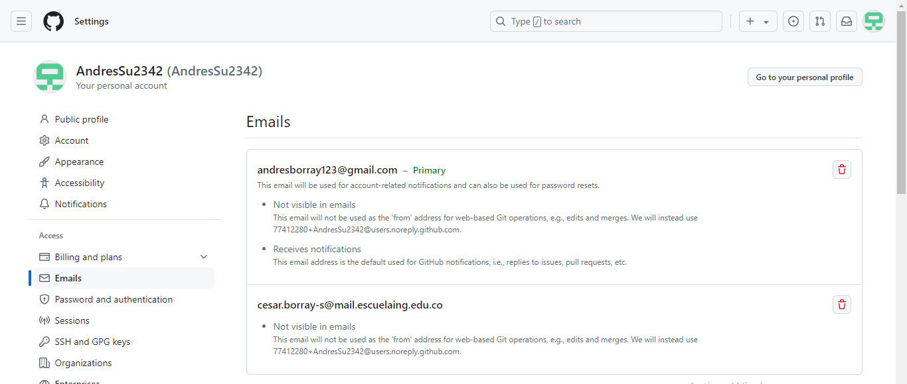
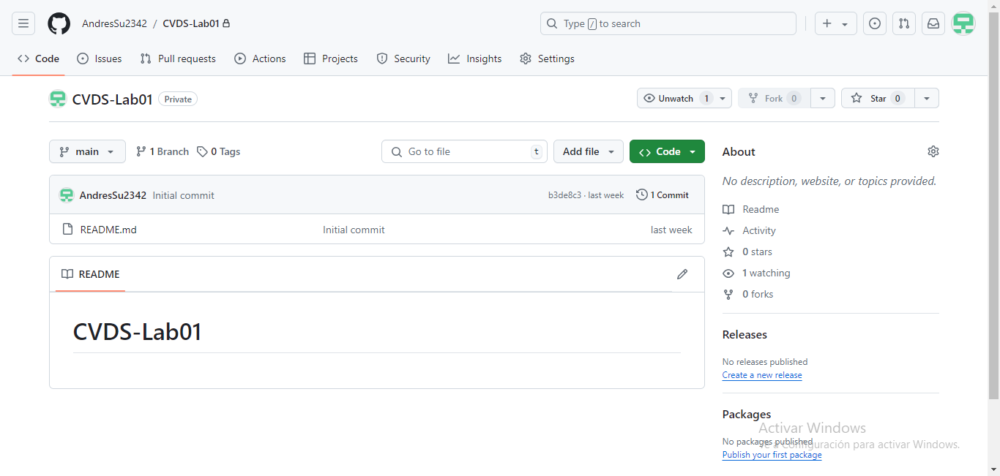

# LABORATORIO 1- INTRODUCCIÓN GIT 

### PARTE I (Trabajo Individual).
#### 1. git add

**Propósito:**
El comando **git add** se usa para agregar cambios en archivos a la zona de preparación (staging area). Esta zona es una especie de área temporal donde Git recopila los cambios que deseas incluir en tu próximo commit.

**Cómo se usa:**
```
git add <nombre-del-archivo>
```

#### 2. git commit -m "mensaje"

**Propósito:**
El comando **git commit** toma los cambios que has agregado a la zona de preparación y los guarda en el historial de tu repositorio. Este comando crea un nuevo "commit", que es un punto en el tiempo que guarda el estado actual de tu proyecto.

**Cómo se usa:**
```
git commit -m "Descripción de los cambios"
```

### Enlaze con el correo institucional



### Creacion de repositorio

