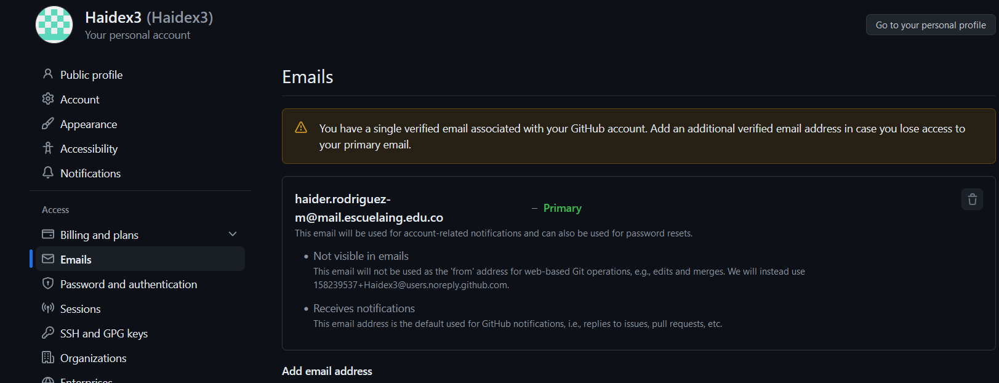
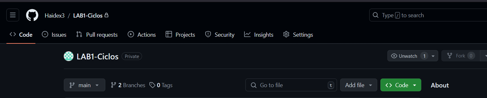

# LABORATORIO 1- INTRODUCCIÓN GIT

### PARTE I (Trabajo Individual).
#### 1. git add

**Propósito:**
El comando git add sirve para mover los cambios realizados en archivos al área de preparación (staging area). Esta área actúa como una zona intermedia donde Git almacena temporalmente los cambios que planeas incluir en tu próximo commit
**Cómo se usa:**

git add <nombre-del-archivo>

#### 2. git commit -m "mensaje"

**Propósito:**
El comando git commit guarda en el historial de tu repositorio los cambios que se han agregado al área de preparación. Al ejecutar este comando, se crea un nuevo "commit", que representa un punto en el tiempo con el estado actual de tu proyecto.
**Cómo se usa:**

git commit -m "Descripción de los cambios"

### Enlaze con el correo institucional

### Creacion de repositorio

